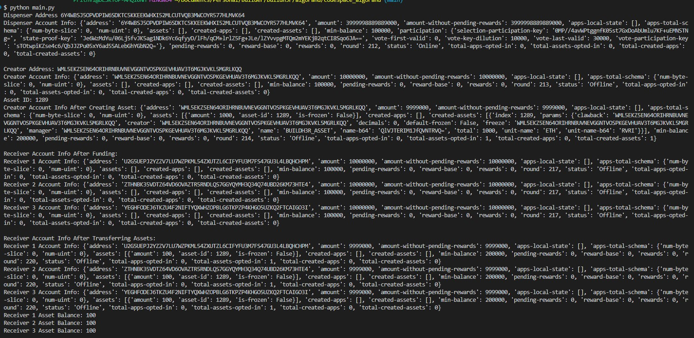

# Algorand Workshop

This code demonstrates the creation and transfer of Algorand Standard Assets (ASAs) using the Algorand Python SDK.

## Steps

1. **Initialize Algorand Client**:

   - The code initializes an instance of `AlgorandClient` for interacting with the Algorand blockchain.

2. **Retrieve Dispenser Account**:

   - The dispenser account is retrieved, which is used to fund other accounts with ALGOs (the native cryptocurrency of Algorand).

3. **Print Dispenser Information**:

   - The address and account information of the dispenser are printed to the console.

4. **Generate Creator Account**:

   - A random account is generated to act as the creator of the asset.

5. **Fund Creator Account**:

   - ALGOs are transferred from the dispenser account to the creator account to cover transaction fees.

6. **Print Creator Account Information Before Creating Asset**:

   - The account information of the creator account is printed to the console before creating the asset.

7. **Create Algorand Standard Asset (ASA)**:

   - An ASA is created using the `asset_create` method, specifying parameters such as total supply, asset name, unit name, manager, clawback, and freeze addresses.

8. **Print Asset ID**:

   - The asset ID generated for the newly created ASA is printed to the console.

9. **Print Creator Account Information After Creating Asset**:

   - The account information of the creator account is printed to the console after creating the asset.

10. **Fund Receiver Accounts**:

    - Random accounts are generated to act as receivers, and ALGOs are transferred from the dispenser account to each receiver account.

11. **Print Receiver Account Information After Funding**:

    - The account information of each receiver account is printed after funding.

12. **Opt-in Receivers to Asset**:

    - Each receiver account opts in to receive the newly created ASA by including an `asset_opt_in` transaction in a group transaction.

13. **Transfer Assets to Receivers**:

    - The creator account transfers a specified amount of the ASA to each receiver account in a group transaction.

14. **Print Receiver Account Information After Transferring Assets**:

    - The account information of each receiver account is printed to the console after receiving the assets.

15. **Print Receiver Asset Balances**:
    - The asset balances of each receiver account are printed to the console.

## Screenshots

