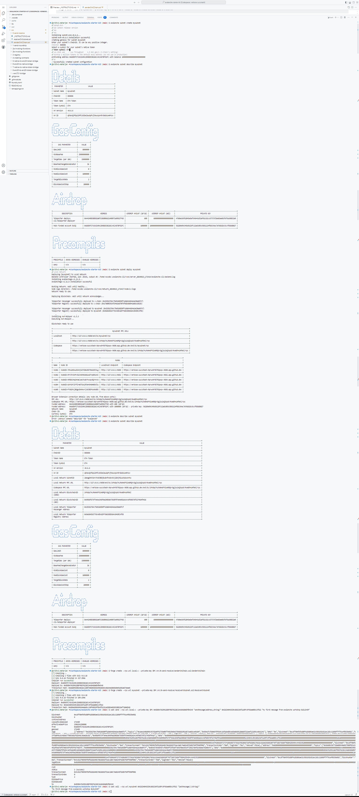

# Avalanche Workshop

All of the following steps has been performed in the Github Alogrand Codespace.

## Screenshots

1. **Creating a subnet**

   

2. **Deploying the subnet**

   

3. **Describing the subnet**

   

4. **Deploying the sender contract**

   

5. **Deploying the receiver contract**

   

6. **Sending the message**

   

7. **Verifying the message**

   

8. **All the process in a single screenshot**

   
